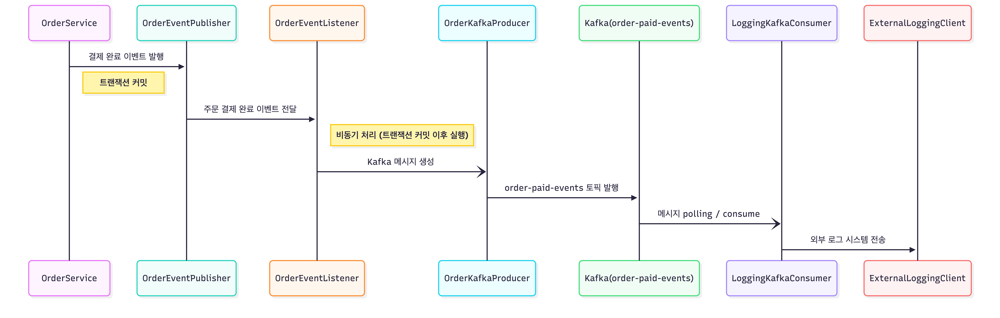

# Kafka 적용 개선안 보고서

## 📋 목차
1. [Kafka 개요](#-kafka-개요)
2. [적용 배경 및 이유](#-적용-배경-및-이유)
3. [시스템 구성](#-시스템-구성)
4. [주요 개선 사항](#-주요-개선-사항)
5. [기술적 세부사항](#-기술적-세부사항)
6. [모니터링 및 운영](#-모니터링-및-운영)
7. [향후 확장 가능성](#-향후-확장-가능성)

---

## 🔍 Kafka 개요

### Kafka란?

Apache Kafka는 **분산 이벤트 스트리밍 플랫폼**으로, 대용량의 실시간 데이터를 안정적으로 처리할 수 있는 메시지 브로커입니다.

#### 주요 특징

- **높은 처리량**: 초당 수백만 개의 메시지 처리 가능
- **확장성**: 수평 확장을 통한 클러스터 구성 지원
- **내구성**: 디스크 기반 데이터 영속성으로 메시지 유실 방지
- **분산 처리**: 파티셔닝과 복제를 통한 고가용성 보장

#### 핵심 개념

| 개념 | 설명 |
|-----|------|
| **Producer** | 메시지를 Kafka 토픽에 발행하는 주체 |
| **Consumer** | Kafka 토픽의 메시지를 구독하여 소비하는 주체 |
| **Topic** | 메시지를 분류하는 논리적 채널 |
| **Partition** | 토픽을 나눈 물리적 단위, 병렬 처리 가능 |
| **Broker** | Kafka 서버 인스턴스 |
| **Consumer Group** | 협력하여 메시지를 소비하는 Consumer 그룹 |

---

## 💡 적용 배경 및 이유

### 문제 상황

기존 시스템에서는 주문 결제 완료 시 **Spring Event 기반으로 이벤트 리스너가 외부 로깅 시스템을 직접 호출**하여 이벤트를 전송했습니다.

```java
// 기존 방식 (Spring Event + 직접 HTTP 호출)
OrderService.processPayment()
  └─> Spring Event 발행 (OrderPaidEvent)
      └─> OrderEventListener (@Async)
          └─> ExternalLoggingClient.sendLog()  // 외부 시스템 직접 HTTP 호출
              ├─> 성공: 정상 처리
              └─> 실패: 이벤트 유실 (로그만 기록)
```

#### 문제점

1. **애플리케이션 내부 결합**: 동일 JVM 내부에서만 동작, 다른 서비스로 확장 불가
2. **강한 결합**: 이벤트 리스너가 외부 로깅 시스템과 직접 연결
3. **메시지 유실 위험**: 외부 시스템 장애 시 이벤트 손실 (재시도 없음)
4. **장애 추적 어려움**: 실패한 이벤트에 대한 추적 및 재처리 불가

### 해결 방안: Kafka 도입

Kafka를 메시지 브로커로 도입하여 **이벤트 기반 아키텍처**로 전환했습니다.

#### 기대 효과

| 효과 | 설명 |
|-----|------|
| **비동기 처리** | 주문 처리와 로깅이 분리되어 응답 시간 단축 |
| **장애 격리** | 외부 시스템 장애가 비즈니스 로직에 영향 없음 |
| **확장성** | 새로운 Consumer 추가만으로 기능 확장 (알림, 분석 등) |
| **신뢰성** | 메시지 영속성과 재시도로 데이터 유실 방지 |

---

## 🏗️ 시스템 구성

### Kafka 적용 프로세스 (결제 완료)



**참고**: `쿠폰 발급`에는 kafka 적용하지 않고 Redis Streams 사용 유지
- 쿠폰 발급은 정합성과 즉각적인 처리 속도가 더 중요하다. 메모리 기반의 Redis Streams 사용을 유지했다.
- 재처리 구현도 하지 않았다. 단발적인 경쟁 처리이기 때문에 재시도는 의미없다고 판단했다.


### 구성 요소

#### 1. Producer 측 (주문 서비스)

```
OrderService
  └─> 결제 완료 시 Spring Event 발행 (트랜잭션 커밋 이후 실행)
      └─> OrderEventPublisher
          └─> OrderEventListener (비동기)
              └─> OrderKafkaProducer
                  └─> Kafka 토픽 "order-paid-events"로 발행
```

**주요 클래스**:
- `OrderService`: 주문 비즈니스 로직 처리
- `OrderEventPublisher`: Spring ApplicationEventPublisher 활용
- `OrderEventListener`: `@TransactionalEventListener` 활용하여 트랜잭션 커밋 이후 실행
- `OrderKafkaProducer`: Kafka Producer 구현
- `OrderKafkaMessage`: 메시지 DTO

#### 2. Kafka 클러스터

```yaml
브로커 구성:
  - localhost:19092 (broker-1)
  - localhost:29092 (broker-2)
  - localhost:39092 (broker-3)

토픽 설정:
  - order-paid-events: 파티션 3개, 복제본 3개
  - order-paid-events.DLQ: Dead Letter Queue
```

#### 3. Consumer 측 (로깅 서비스)

```
Kafka 토픽 "order-paid-events"
  └─> LoggingKafkaConsumer
      └─> 메시지 수신 및 역직렬화
          └─> ExternalLoggingClient
              └─> 외부 로깅 시스템 (http://localhost:3000/logs)
```

**주요 클래스**:
- `LoggingKafkaConsumer`: `@KafkaListener` 활용
- `ExternalLoggingClient`: RestTemplate 기반 HTTP 클라이언트

### 메시지 포맷

```json
{
  "eventType": "ORDER_PAID",
  "orderId": 123,
  "userId": 456,
  "paidAt": "2025-12-19T10:30:00",
  "orderItems": [
    {
      "productId": 1,
      "orderQuantity": 2
    }
  ]
}
```

---

## ✨ 주요 개선 사항

### 1. Producer 재시도 및 멱등성 보장

**설정 (application.properties)**:
```properties
spring.kafka.producer.acks=all                              # 모든 replica ACK 대기
spring.kafka.producer.properties.enable.idempotence=true    # 멱등성 보장
spring.kafka.producer.retries=3                             # 최대 3회 재시도
spring.kafka.producer.properties.retry.backoff.ms=1000      # 재시도 간격 1초
```

**효과**:
- 일시적 네트워크 오류 자동 복구
- 메시지 중복 방지 (멱등성)
- 메시지 순서 보장

---

### 2. Fallback DB 저장 메커니즘

Kafka 발행 실패 시 메시지를 데이터베이스에 저장하고, 주기적으로 재발행을 시도합니다.

#### 아키텍처

```
OrderKafkaProducer
  └─> Kafka 발행 시도
      ├─> [성공] 로그 기록
      └─> [실패] KafkaFallbackService
          └─> kafka_fallback_message 테이블에 저장
              └─> KafkaFallbackScheduler (1분마다 실행)
                  └─> 재발행 시도
                      ├─> 성공: status = PUBLISHED
                      └─> 실패: 지수 백오프 후 재시도
```

#### 주요 컴포넌트

**KafkaFallbackMessage 엔티티**:
| 필드 | 설명 |
|-----|------|
| `topic` | Kafka 토픽명 |
| `messageKey` | 메시지 키 |
| `payload` | JSON 메시지 본문 |
| `retryCount` | 현재 재시도 횟수 |
| `maxRetry` | 최대 재시도 횟수 (기본: 3) |
| `status` | PENDING / PUBLISHED / FAILED |
| `nextRetryAt` | 다음 재시도 시각 |
| `errorMessage` | 실패 사유 |

**KafkaFallbackService**:
- `saveFallbackMessage()`: Fallback 메시지 DB 저장
- `retryPendingMessages()`: 재시도 대상 조회 및 재발행
- `getStats()`: 통계 조회 (PENDING, PUBLISHED, FAILED 건수)

**KafkaFallbackScheduler**:
- 1분마다 대기 중인 메시지 재발행 시도
- 1시간마다 통계 로깅

#### 재시도 전략

- **지수 백오프**: 1분, 2분, 4분, 8분 (2^n 분)
- **최대 재시도**: 3회
- **최종 상태**: PUBLISHED (성공) / FAILED (최대 재시도 초과 시 수동 처리 필요)

---

### 3. Consumer 재시도 + DLQ (Dead Letter Queue)

Consumer 처리 실패 시 자동 재시도 후, 최종 실패한 메시지는 DLQ로 전송합니다.

#### 설정 (KafkaConsumerConfig)

```java
@Bean
public CommonErrorHandler errorHandler(KafkaTemplate kafkaTemplate) {
    // 지수 백오프: 1초, 2초, 4초 (최대 3회)
    ExponentialBackOffWithMaxRetries backOff = new ExponentialBackOffWithMaxRetries(3);
    backOff.setInitialInterval(1000);
    backOff.setMultiplier(2.0);
    backOff.setMaxInterval(10000);

    // DLQ Recoverer: 실패 메시지를 [원본토픽].DLQ로 전송
    DeadLetterPublishingRecoverer recoverer =
        new DeadLetterPublishingRecoverer(kafkaTemplate, ...);

    return new DefaultErrorHandler(recoverer, backOff);
}
```

#### 처리 흐름

```
LoggingKafkaConsumer
  └─> externalLoggingClient.sendLog()
      ├─> [성공] ACK
      └─> [실패] DefaultErrorHandler
          ├─> 재시도 1 (1초 후)
          ├─> 재시도 2 (2초 후)
          ├─> 재시도 3 (4초 후)
          └─> [최종 실패]
              └─> DeadLetterPublishingRecoverer
                  └─> order-paid-events.DLQ 토픽으로 전송
```

#### 변경 사항

**Before**:
```java
catch (Exception e) {
    // 로그만 남기고 끝 (메시지 유실 가능)
    log.error("Failed to process...", e);
}
```

**After**:
```java
// try-catch 제거 → ErrorHandler가 자동 처리
externalLoggingClient.sendLog(message);
```

---

### 4. 개선 효과 요약

| 구분 | 기존 | 개선 후 |
|-----|------|--------|
| **메시지 유실** | 발행 실패 시 유실 | Fallback DB + 재발행으로 방지 |
| **Producer 재시도** | 없음 | 자동 재시도 3회 + 멱등성 보장 |
| **Consumer 재시도** | 로그만 기록 | 자동 재시도 3회 + DLQ 전송 |
| **장애 격리** | 외부 시스템 장애가 주문에 영향 | Kafka가 버퍼 역할, 완전 분리 |
| **모니터링** | 어려움 | Kafka UI + Fallback 통계 + DLQ |

---

## 🔧 기술적 세부사항

### Producer 설정

```properties
# 신뢰성 설정
spring.kafka.producer.acks=all                                    # 모든 replica 확인
spring.kafka.producer.properties.enable.idempotence=true          # 중복 방지
spring.kafka.producer.retries=3                                   # 재시도 3회
spring.kafka.producer.properties.retry.backoff.ms=1000            # 재시도 간격
spring.kafka.producer.properties.request.timeout.ms=30000         # 요청 타임아웃
spring.kafka.producer.properties.delivery.timeout.ms=120000       # 전달 타임아웃
spring.kafka.producer.properties.max.in.flight.requests.per.connection=5
```

### Consumer 설정

```properties
# 기본 설정
spring.kafka.consumer.group-id=logging-consumer-group
spring.kafka.listener.concurrency=3                               # 동시 처리 스레드 3개

# 재시도 설정
kafka.consumer.retry.max-attempts=3
kafka.consumer.retry.backoff.initial-interval=1000
kafka.consumer.retry.backoff.multiplier=2.0
```

### 토픽 설정

```properties
kafka.topic.common.partitions=3                                   # 파티션 3개
kafka.topic.common.replications=3                                 # 복제본 3개
kafka.topic.order-paid=order-paid-events
```

### 주요 파일 구조

```
src/main/java/com/example/ecommerceapi/
├── order/
│   ├── application/
│   │   ├── service/OrderService.java
│   │   └── event/OrderEventPublisher.java
│   ├── domain/
│   │   └── event/OrderPaidEvent.java
│   └── infrastructure/
│       └── kafka/
│           ├── producer/OrderKafkaProducer.java
│           └── dto/OrderKafkaMessage.java
├── common/infrastructure/
    ├── kafka/
    │   ├── config/
    │   │   ├── KafkaTopicConfig.java
    │   │   └── KafkaConsumerConfig.java
    │   ├── consumer/LoggingKafkaConsumer.java
    │   ├── entity/KafkaFallbackMessage.java
    │   ├── repository/KafkaFallbackMessageRepository.java
    │   ├── service/KafkaFallbackService.java
    │   └── scheduler/KafkaFallbackScheduler.java
    └── external/
        ├── client/ExternalLoggingClient.java
        └── listener/ExternalLoggingEventListener.java
```

---

## 📊 모니터링 및 운영

### 1. Kafka UI (http://localhost:8081)

**확인 항목**:
- **Topics**: `order-paid-events`, `order-paid-events.DLQ` 메시지 확인
- **Consumer Groups**: `logging-consumer-group` 상태 및 Lag 확인
- **Brokers**: 클러스터 상태 확인

### 2. Fallback DB 모니터링

```sql
-- 대기 중인 메시지 (재발행 예정)
SELECT * FROM kafka_fallback_message WHERE status = 'PENDING';

-- 실패한 메시지 (수동 처리 필요)
SELECT * FROM kafka_fallback_message WHERE status = 'FAILED';

-- 통계
SELECT status, COUNT(*)
FROM kafka_fallback_message
GROUP BY status;
```

### 3. 로그 확인

```bash
# Fallback 저장 로그
grep "Saved fallback message" logs/application.log

# Fallback 재발행 성공
grep "Fallback message published successfully" logs/application.log

# DLQ 전송 로그
grep "Publishing failed message to DLQ" logs/application.log

# Consumer 재시도 로그
grep "Retrying message" logs/application.log
```

### 4. 스케줄러 통계 로그

```
[2025-12-19 10:00:00] Fallback message stats - pending: 2, published: 45, failed: 1
```

---

## 📝 결론

Kafka 도입을 통해 **이벤트 기반 아키텍처**로 전환하고, **Fallback DB + DLQ** 메커니즘을 구현하여 메시지 유실을 방지했습니다.

### 핵심 성과

1. **비즈니스 로직과 외부 시스템 완전 분리** → 장애 격리
2. **3단계 안전장치** → Producer 재시도 + Fallback DB + Consumer 재시도
3. **메시지 유실 제로** → 모든 실패 케이스에 대한 대응 완료
4. **확장 가능한 아키텍처** → 새로운 Consumer 추가만으로 기능 확장

이를 통해 **안정적이고 확장 가능한 이벤트 기반 시스템**을 구축했습니다.
